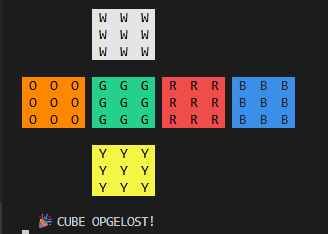

# Giiker Smart Cube uitlezen met Python

Klein hobby-project om mijn Giiker bluetooth-cube uit te lezen vanuit Python.
De cube stuurt na elke zet zijn complete state, en ik render dat als een 2D
flat-view (kruis-net) in de terminal. Doel is om er straks smart-home triggers
aan te hangen (lampen aan/uit bij bepaalde patronen of zetten).



## Welke cube

Werkt met mijn **Giiker GiikerCube** (BLE-naam `Hi-G-12DRL00A6EE`,
fabrikant: Giiker Innovation Technology Co., Ltd.).

- BLE service: `0000aadb-0000-1000-8000-00805f9b34fb`
- State characteristic: `0000aadc-0000-1000-8000-00805f9b34fb` (read + notify)
- Pakketten zijn 20 bytes, versleuteld met de community-known Giiker XOR-key
  (alleen als byte[18] == `0xA7`)

Andere Giiker-modellen met hetzelfde protocol zouden ook moeten werken. Voor een
ander cube-merk (GAN, MoYu, QiYi enz.) is dit script niet geschikt — die hebben
een ander protocol.

## Installatie

```bash
pip install bleak
```

Pas in `cube.py` het MAC-adres aan naar dat van jouw cube:

```python
CUBE_MAC = "EA:E6:DE:1E:DD:B3"
```

Het MAC-adres vind je bv. via `diagnose.py` (zie hieronder) of een BLE-scanner app.

## Gebruik

```bash
python cube.py
```

Verbindt met de cube, leest de initiële state uit, en print bij elke zet een
nieuwe flat-view. Ctrl+C om te stoppen.

Voorbeeld output (opgeloste cube):

```
  Laatste zet: -

           W  W  W
           W  W  W
           W  W  W

 O  O  O   G  G  G   R  R  R   B  B  B
 O  O  O   G  G  G   R  R  R   B  B  B
 O  O  O   G  G  G   R  R  R   B  B  B

           Y  Y  Y
           Y  Y  Y
           Y  Y  Y
```

Kleur-conventie van de cube (de centers staan vast op deze kleuren):
**W = Wit, O = Oranje, G = Groen, R = Rood, B = Blauw, Y = Geel**.

In de terminal worden de stickers met ANSI-achtergrondkleuren weergegeven.

## Hoe werkt het

Pipeline per BLE-notification:

```
20 ruwe bytes (versleuteld)
  │
  ├─ decrypt()        XOR-style obfuscatie ongedaan maken met
  │                   GIIKER_KEY + 2 shifts uit byte 19
  │
  ├─ parse_state()    bytes naar:
  │                     - 8 corner-posities + orientaties
  │                     - 12 edge-posities + orientaties
  │                     - laatste zet (byte 16)
  │
  ├─ build_facelets() cube-stukjes + geometrie naar
  │                   54 kleur-letters (URFDLB volgorde)
  │
  ├─ print_flat_view() gekleurde 2D weergave in terminal
  │
  └─ on_state()       eigen trigger-code (placeholder)
```

### State-encoding (kort)

Een Rubik's cube is volledig beschreven door welk stukje in welk slot zit, plus
hoe het gedraaid is. De 20 bytes zijn als volgt verdeeld:

| Bytes | Inhoud                                                |
| ----- | ----------------------------------------------------- |
| 0–3   | 8 corner-posities (1 nibble per slot, waarde 1–8)     |
| 4–7   | 8 corner-orientaties (waarde 1/2/3, waarbij 3 = ok)   |
| 8–13  | 12 edge-posities (1 nibble per slot, waarde 1–12)     |
| 14–15 | 12 edge-orientaties (1 bit per edge, gepakt)          |
| 16    | Laatste zet (face-nibble + turn-nibble)               |
| 18    | Encryptie-marker (`0xA7`)                             |
| 19    | Shift-bytes voor decryptie                            |

De face-nibble in byte 16 codeert het vlak (1=B, 2=D, 3=L, 4=U, 5=R, 6=F),
de turn-nibble de richting (1=CW, 2=180°, 3=CCW).

### Eigenaardigheden

- **Mirror-slots:** bij hoek-slots 0, 2, 5 en 7 moet de orientatie geïnverteerd
  worden (`3 - o`). Dit zit zo in het originele Giiker JS-protocol — geen idee
  waarom, maar het móet zo.
- **Orientatie = 3 betekent "niet getwist".** Niet 0 zoals je zou verwachten.
- **Laatste zet zit in byte 16, niet byte 18.** Veel oude scripts pakken byte 18,
  maar dat is op deze cube de encryptie-marker. Daarom werkten ze niet.

## Bestanden

- **`cube.py`** — hoofdscript: verbinden, decoden, flat-view, trigger-hook
- **`diagnose.py`** — generieke BLE-diagnose-tool die ik zelf schreef om het
  Giiker-protocol te reverse-engineeren. Dumpt alle services + characteristics
  van een BLE-device en logt elke ruwe notification met timestamp. Werkt voor
  **elk** BLE-device, niet alleen cubes — handig als je een onbekend
  bluetooth-apparaat (hartslagmeter, smart-lamp, sensor, etc.) wil onderzoeken.
  Verander gewoon het MAC-adres en gebruik het apparaat terwijl je luistert.
- **`capture.log`** — voorbeeld-output van `diagnose.py` waarmee ik het
  protocol heb geverifieerd (per-byte handmatig nagerekend)

## Eigen acties toevoegen

In `cube.py` staat `on_state()` als hook-punt. Drie objecten beschikbaar:

```python
def on_state(state, facelets, faces):
    state['last_move']     # bv. "R", "U'", "F2"
    facelets               # platte lijst van 54 kleur-letters
    faces['U'][row][col]   # 3x3 matrix per vlak
```

Voorbeeld: alles aanzetten als hele bovenkant wit is

```python
if all(c == 'W' for row in faces['U'] for c in row):
    # bv. Hue API call, MQTT publish, Home Assistant webhook
    ...
```

Of reageren op een specifieke zet-sequentie door zelf een geschiedenis bij te
houden.

## Hoe ik dit heb gebouwd

Er zijn online wel wat (half-werkende) Giiker-decoders te vinden, maar geen
ervan werkte op mijn specifieke cube — meeste gokten gewoon protocol-details
die voor hun model wel klopten en voor het mijne niet. In plaats van blijven
gokken heb ik het systematisch aangepakt:

1. **Discovery** met `diagnose.py`: alle BLE services + characteristics
   gedumpt en bevestigd welke `notify` ondersteunt.
2. **Raw capture**: tegelijk op álle notify-characteristics geluisterd terwijl
   ik een bekende zet-sequentie deed (solved → R → R' → solved → U → ...).
   Output naar `capture.log`.
3. **Handmatige decode**: 2 packets op papier door de XOR-key gehaald om te
   verifiëren welke bytes de cube-state coderen en waar de "laatste zet" zit.
   Bleek byte 16 te zijn, niet byte 18 (de meest gemaakte fout in bestaande
   scripts — daar zit de encryptie-marker).
4. **Decoder bouwen** in `cube.py` op basis van die verified mapping, met
   sticker-geometrie geport vanuit de originele Giiker JS-library.

Werkte in één keer goed nadat de bytes bevestigd waren.

## TODO

- [ ] Koppelen aan smart-home (Hue / Home Assistant)
- [ ] Trigger-systeem op patronen (bv. T-shape, cross-only-opgelost)
- [ ] Reconnect-logica als de cube even uit gaat
- [ ] Battery-level uitlezen (via system service `0000aaaa`)
